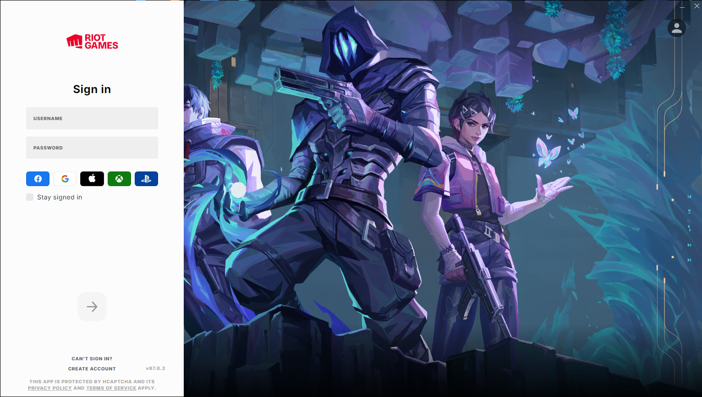
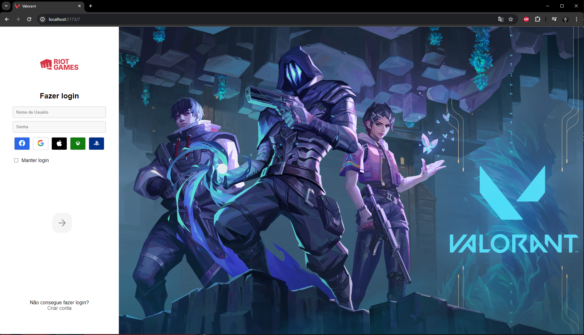

# Clone tela de Login do Valorant

Esse projeto é a realização da P1 da matéria de React do Serratec, que consiste em clonar alguma tela de login a sua escolha e utilizar: 

- Hooks:
    - useState: para login e senha;
    - useEffect: para verificar se login e senha estão corretos;
- styles.module.css;

## Imagem utilizada para o clone:

## Resultado do clone
