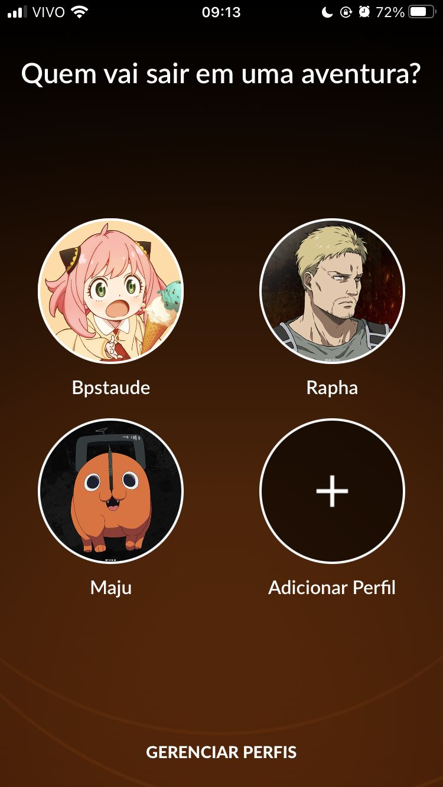

# Trabalho individual - React Native

Este projeto consiste em criar um clone de uma tela de uma aplicação existente em React Native, utilizando pelo menos dois componentes distintos.

    

        <h2>Referência</h2>
        
    

    

        <h2>Clone</h2>
        
    

